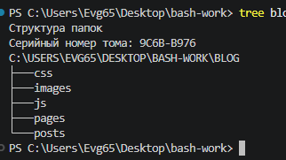
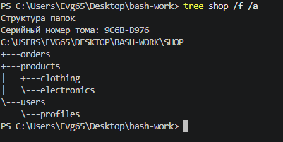
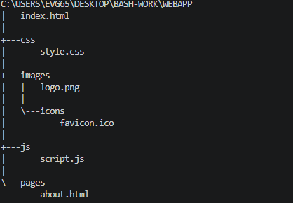
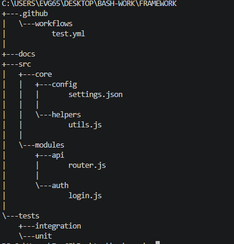
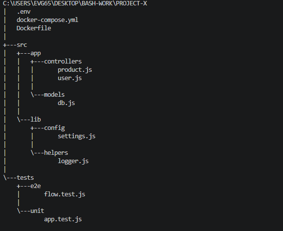

# Самостоятельная работа по командной строке Bash
**Выполнил:** Белевитин Евгений Александрович

---

## 📁 Структура проекта и команды автоматизации

В данном репозитории представлены выполненные задания по созданию файловой структуры с помощью команд Bash.

### 1. Блог (blog/)

**Схема структуры:**
```text
blog/
├── posts/
├── pages/
├── images/
├── css/
└── js/
```

**Bash-скрипт для создания:**
```bash
mkdir -p blog/{posts,pages,images,css,js}
```

---

### 2. Интернет-магазин (shop/)

**Схема структуры:**
```text
shop/
├── products/
│   ├── electronics/
│   └── clothing/
├── users/
│   └── profiles/
└── orders/
```

**Bash-скрипт для создания:**
```bash
mkdir -p shop/{products/{electronics,clothing},users/profiles,orders}
```

---

### 3. Веб-проект (webapp/)

**Схема структуры:**
```text
webapp/
├── css/
│   └── style.css
├── js/
│   └── script.js
├── images/
│   ├── logo.png
│   └── icons/
│       └── favicon.ico
├── pages/
│   └── about.html
└── index.html
```

**Bash-скрипт для создания:**
```bash
mkdir -p webapp/{css,js,images/icons,pages}
touch webapp/css/style.css webapp/js/script.js webapp/images/logo.png webapp/images/icons/favicon.ico webapp/pages/about.html webapp/index.html
```

---

### 4. Фреймворк (framework/)

**Схема структуры:**
```text
framework/
├── src/
│   ├── core/
│   │   ├── config/
│   │   │   └── settings.json
│   │   └── helpers/
│   │       └── utils.js
│   └── modules/
│       ├── auth/
│       │   └── login.js
│       └── api/
│           └── router.js
├── tests/
│   ├── unit/
│   └── integration/
├── docs/
└── .github/
    └── workflows/
        └── test.yml
```
!
**Bash-скрипт для создания:**
```bash
mkdir -p framework/{src/{core/{config,helpers},modules/{auth,api}},tests/{unit,integration},docs,.github/workflows}
touch framework/src/core/config/settings.json framework/src/core/helpers/utils.js framework/src/modules/auth/login.js framework/src/modules/api/router.js framework/.github/workflows/test.yml
```

---

### 5. Проект X (project-x/)

**Схема структуры:**
```text
project-x/
├── src/
│   ├── app/
│   │   ├── controllers/
│   │   │   ├── user.js
│   │   │   └── product.js
│   │   └── models/
│   │       └── db.js
│   └── lib/
│       ├── helpers/
│       │   └── logger.js
│       └── config/
│           └── settings.js
├── tests/
│   ├── unit/
│   │   └── app.test.js
│   └── e2e/
│       └── flow.test.js
├── .env
├── Dockerfile
└── docker-compose.yml
```

**Bash-скрипт для создания:**
```bash
mkdir -p project-x/{src/{app/{controllers,models},lib/{helpers,config}},tests/{unit,e2e}}
touch project-x/src/app/controllers/{user.js,product.js} project-x/src/app/models/db.js project-x/src/lib/helpers/logger.js project-x/src/lib/config/settings.js project-x/tests/unit/app.test.js project-x/tests/e2e/flow.test.js project-x/{.env,Dockerfile,docker-compose.yml}
```
### 6 как в заметках

ГРУППА 1: Управление терминалом

history


ГРУППА 2: Файловые операции


ГРУППА 3: Создание и удаление


ГРУППА 4: Структура проекта (Brace Expansion)

ГРУППА 5: Копирование и перемещение


ГРУППА 6: Системные команды (Linux)


ГРУППА 8: Работа с файлами (продолжение)


---

## 🛠 Использованные команды

Основные команды, применённые в работе:
* `mkdir -p` — создание вложенных директорий без ошибок, если родительские папки ещё не существуют.
* `touch` — создание пустых файлов.
* `{,}` — раскрытие фигурных скобок (Brace Expansion) для массового создания папок и файлов одной строкой.

---

## 📦 Результат

Все структуры успешно созданы на локальной машине с помощью терминала Bash, проверены командой `tree` и загружены в удалённый репозиторий GitHub.
